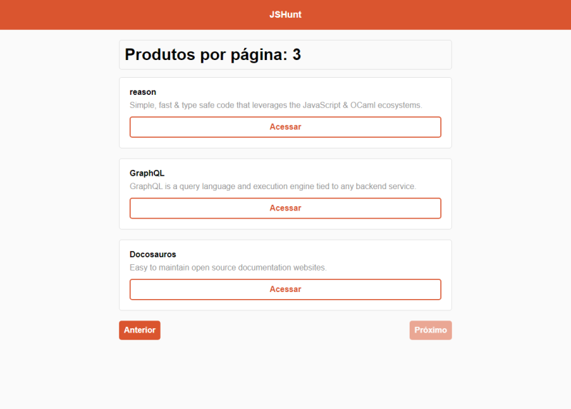

## Aplicação implementada durante a trilha Starter da Rocketseat
 
A aplicação tem a finalidade de consumir uma [API](https://api-node2020.herokuapp.com/) implementada em NodeJS também durante a trilha Starter, o deploy de ambas foi feito utilizando a plataforma [Heroku](https://www.heroku.com/).

## Recursos
- ReactJS
- React Dom
- Axios
- Dotenv

[Aplicação em produção](https://aad-hunt.herokuapp.com/)

This project was bootstrapped with [Create React App](https://github.com/facebook/create-react-app).